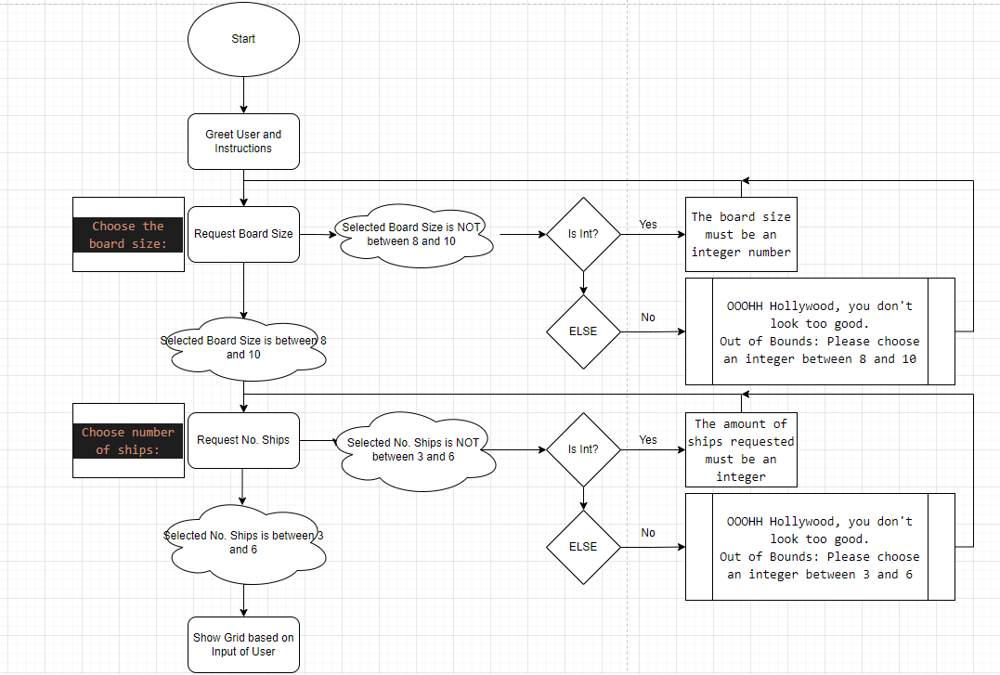
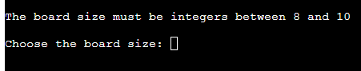
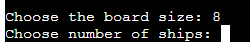
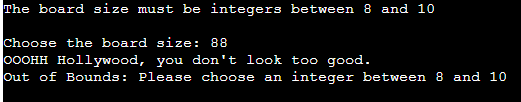
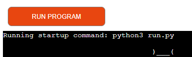
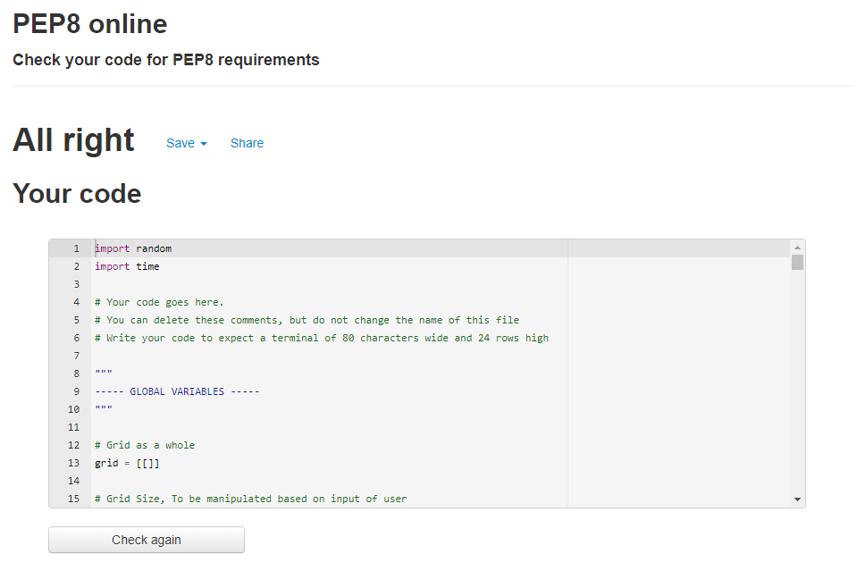
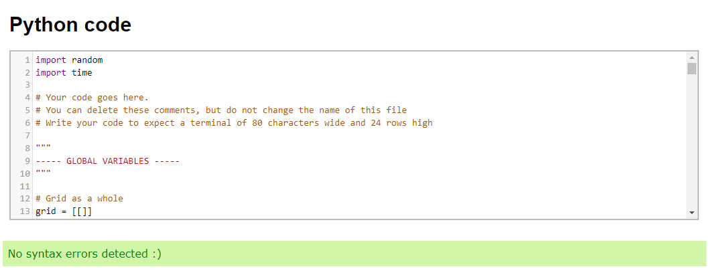

# Top-Ship
(Developer: Keith Bautista)

[Live Webpage](https://top-ship.herokuapp.com/)

1. [Project Goals](#project-goals)
    1. [User Goals](#user-goals)
    2. [Site Owner Goals](#site-owner-goals)
2. [User Experience](#user-experience)
    1. [Target Audience](#target-audience)
    2. [User Requirements and Expectations](#user-requirements-and-expectations)
    3. [User Stories](#user-stories)
    4. [Site Owner Stories](#site-owner-stories)
3. [Technical Design](#technical-design)
    1. [Flowchart](#flowchart)
4. [Technologies Used](#technologies-used)
    1. [Languages](#languages)
    2. [Frameworks & Tools](#frameworks-&-tools)
5. [Features](#features)
6. [Testing](#validation)
    1. [PEP8 validation](#pep8-validation)
    2. [Testing user stories](#testing-user-stories)
8. [Bugs](#Bugs)
9. [Deployment](#deployment)
10. [Credits](#credits)
11. [Acknowledgments](#acknowledgments)

## Project Goals
Top-Ship is an application that mimics the very popular boardgame "Battleship", though with a little Top-Gun twist :)

### User Goals
- Enjoy a memorable game such as Battleship and also get lost in the sea with hints of Top-Gun loitered about.

### Site Owner Goals
- Providing users with the ability to play a fun filled game from their childhood at the tips of their fingers and without having to clean up!

## User Experience

### Target Audience
- People who grew up with Battleship as one of their board games and Top-Gun as their favorite movies.
- People who would like to play a board game from the comfort of their phone and not having to clean up the board game.

### User Requirements and Expectations
- Easy to load and set up with having minimal input
- Ability to personalize the game to your liking
- Easy to use

### User Stories
1. As a user, I want to be able to open up the game without having to set it up
2. As a user, I want to be able to personalise the game based to my liking 
3. As a user, I want to be able to see the game in an easy to read format and grid

### Site Owner Stories
4. As a site owner, I want users to be able to personalise the game to their liking
5. As a site owner, I want users to easily load the game and see an easy to understand format game.

## Technical Design

### Flowchart

Flowchart

## Technologies Used

### Languages
- Python 3

### Frameworks and Tools
- diagrams.net - to create a flow chart
- GitHub
- GitPod
- Git
- Heroku
- Textart.io - to create image out of text for homepage

## Features

### Welcome Message
- Shows a welcome message and an ASCII art containing a ship with the words Top-Ship across its side.

Welcome message

### Choose Board Size
- Ability to choose board size to user liking

Choose Board Size

### Choose No. Ships
- Ability to choose amount of ships to user liking

Choose No. Ships

### User Input Validation
- If Board Size or Ship No is too big or incorrect format then we request for the input again.

Input validation

### Easily Reset Game
- Ability to easily reset the game through a click of a button

Reset Game

## Validation
PEP8 online was used to check the code for PEP8 requirements.
All code passed with no errors and no warnings to show.

run.py

extendsclass was also used as a Python Validator on top of the IDE.
All code passed with no errors and no warnings to show.

run.py

