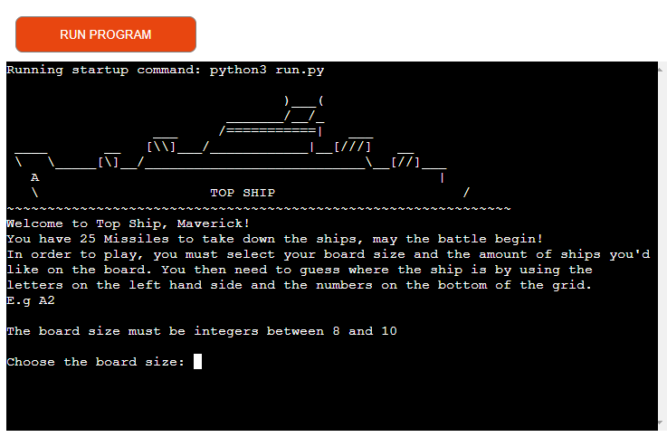

# Top-Ship
(Developer: Keith Bautista)

[Live Webpage](https://top-ship.herokuapp.com/)

1. [Project Goals](#project-goals)
    1. [User Goals](#user-goals)
    2. [Site Owner Goals](#site-owner-goals)
2. [User Experience](#user-experience)
    1. [Target Audience](#target-audience)
    2. [User Requirements and Expectations](#user-requirements-and-expectations)
    3. [User Stories](#user-stories)
    4. [Site Owner Stories](#site-owner-stories)
3. [Technical Design](#technical-design)
    1. [Flowchart](#flowchart)
4. [Technologies Used](#technologies-used)
    1. [Languages](#languages)
    2. [Frameworks & Tools](#frameworks-&-tools)
5. [Features](#features)
6. [Testing](#validation)
    1. [PEP8 validation](#pep8-validation)
    2. [Testing user stories](#testing-user-stories)
8. [Bugs](#Bugs)
9. [Deployment](#deployment)
10. [Credits](#credits)
11. [Acknowledgments](#acknowledgments)

## Project Goals
Top-Ship is an application that mimics the very popular boardgame "Battleship", though with a little Top-Gun twist :)

### User Goals
- Enjoy a memorable game such as Battleship and also get lost in the sea with hints of Top-Gun loitered about.

### Site Owner Goals
- Providing users with the ability to play a fun filled game from their childhood at the tips of their fingers and without having to clean up!
